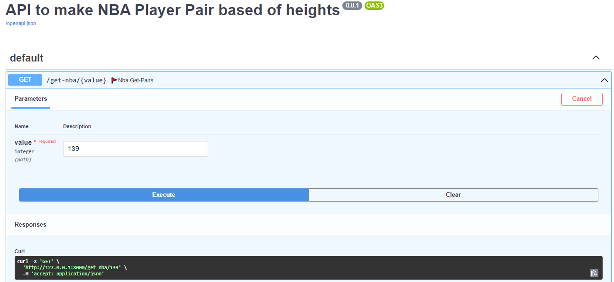
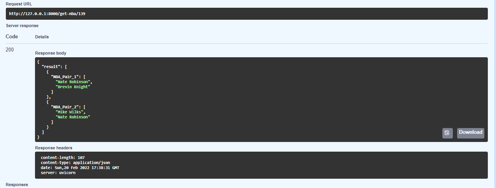

# mach-eight-challenge
==============================

The project is to write a function that searches through NBA player heights based on user input. The raw data is taken from [https://www.openintro.org/data/index.php?data=nba_heights)](https://www.openintro.org/data/index.php?data=nba_heights).  The data is served in json format by the endpoint [https://mach-eight.uc.r.appspot.com/)](https://mach-eight.uc.r.appspot.com/).

The task is to create an application that takes a single integer input. The application will download the raw data from the website above [https://mach-eight.uc.r.appspot.com)](https://mach-eight.uc.r.appspot.com) and print a list of all pairs of players whose height in inches adds up to the integer input to the application. If no matches are found, the application will print `No matches found`


#### Sample output is as follows:
```
> app 139

- Brevin Knight         Nate Robinson
- Nate Robinson         Mike Wilks
```

The algorithm to find the pairs must be faster than `O(n^2)`. All edge cases
should be handled appropriately. This is _not_ a closed book test. You are
encouraged to reach out with any questions that you come across.

#### Evaluation

All candidates who submit an algorithm that is efficient and correct will pass
to the next step of the interview process. We define "efficient" as faster than
O(n^2) and "correct" as returning the correct results for all possible inputs.
Any assignment that doesn't return the correct answer for the sample input
above (139) will fail.

## Solution

### Algorithm 

This problem can be solved efficiently by using the technique of hashing. Use a hash_map to check for the current array value x(let), if there exists a value target_sum-x which on adding to the former gives target_sum. This can be done in constant time. Let’s look at the algorithm in [`modelling/app.py`](https://github.com/NILodio/mach-eight-challenge/blob/master/modelling/app.py)

#### Complexity Analysis:

- Time Complexity: O(n).

As the whole array is needed to be traversed only once.

- Auxiliary Space: O(n).

A hash map has been used to store array elements.

### Algorithm Aproach
```Python
def findpairs(self, value: int):
    self.hashmap = {}
    self.count = 0
    for i in range(0, len(self.data)):
        self.temp = []
        v = int(self.data[i]['h_in'])
        t = value - v
        if (t in self.hashmap):
            self.count += 1
            self.result.append({f'NBA_Pair_{self.count}': [
                                self.data[i]['first_name'] + ' ' + self.data[i]['last_name'], self.data[self.hashmap[t]]['first_name'] + ' ' + self.data[self.hashmap[t]]['last_name']]})
        self.hashmap[int(self.data[i]['h_in'])] = i
```
### How to use it ?

### Pakages

```
pip install -r requirements.txt

```

### ENV Variables
```
SET/EXPORT config_file=config.yml

```

### Pytest

It will run some tests from [`tests`](https://github.com/NILodio/mach-eight-challenge/blob/master/test/test_app.py)

```
pytest -co

```
#### Example output: 
```
<Package test>
  <Module test_app.py>
    <Function test_value_139>
    <Function test_value_100>
    <Function test_value_140>
    <Function test_value_160>

================================================================= 4 tests collected in 0.16s ==================================================================
```

## Service Fast Api Demo

- Run

```
uvicorn service.main:app --reload

```





